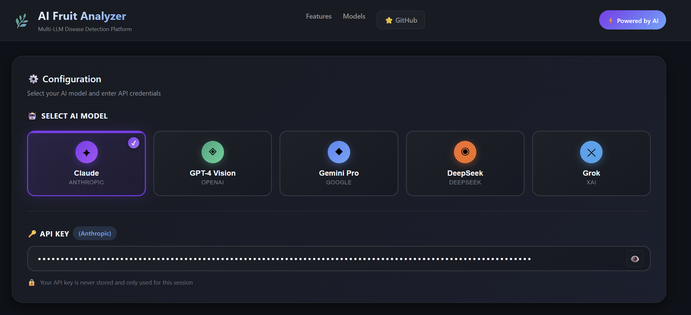
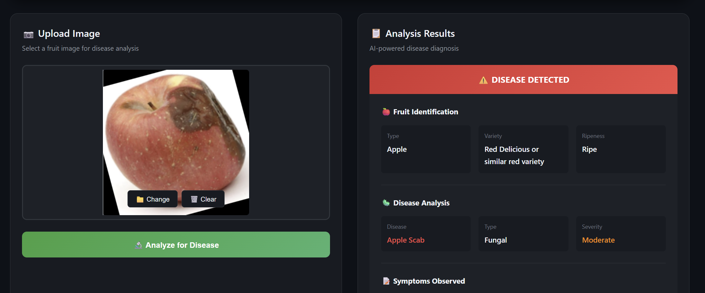
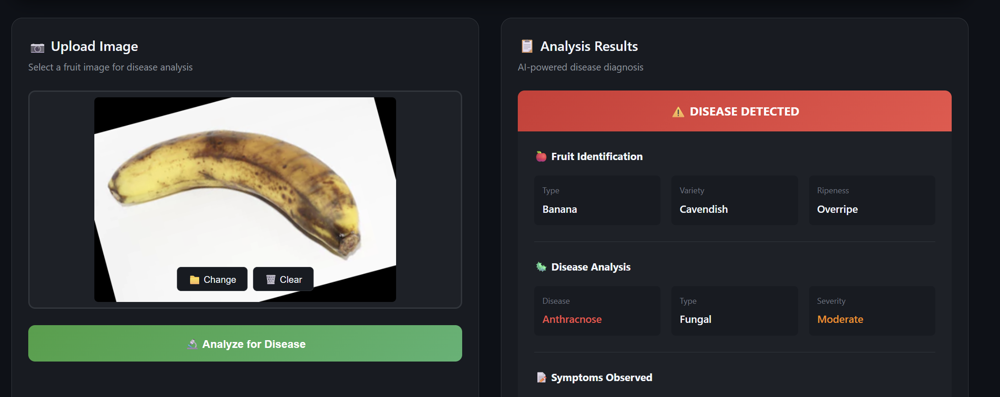
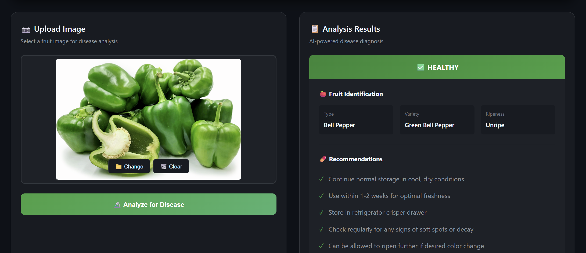

# LLM Vision Fruit Disease Detection

[](LICENSE)
[](https://reactjs.org/)
[](https://fastapi.tiangolo.com/)
[](https://python.org/)
[](https://www.anaconda.com/)

**Multi-LLM Vision Platform for Agricultural Disease Detection**

A professional full-stack web application that leverages multiple Large Language Models (LLMs) with vision capabilities to detect diseases in fruits and vegetables through image analysis.

---

## 🎬 Demo


---

## 📸 Screenshots - Results

### Configuration Panel


### Image Upload


### Analysis in Progress


### Results


---


## 📊 Dataset

This project uses the **Fruit and Vegetable Disease Dataset** from Kaggle:

🔗 **[Download Dataset](https://www.kaggle.com/datasets/muhammad0subhan/fruit-and-vegetable-disease-healthy-vs-rotten)**

### Covered Fruits & Vegetables:
| Fruits | Vegetables |
|--------|------------|
| 🍎 Apple | 🫑 Bell Pepper |
| 🍌 Banana | 🥕 Carrot |
| 🍇 Grape | 🥒 Cucumber |
| 🍊 Orange | 🥔 Potato |
| 🍑 Peach | 🍅 Tomato |
| 🍐 Pear | 🌽 Corn |
| 🍍 Pineapple | 🥬 Lettuce |
| 🍓 Strawberry | 🧅 Onion |
| 🍉 Watermelon | 🥦 Broccoli |
| 🥭 Mango | 🍆 Eggplant |

### Dataset Categories:
- ✅ **Healthy** — Fresh, disease-free samples
- ❌ **Rotten/Diseased** — Various disease conditions

---

## ✨ Features

- 🤖 **Multi-LLM Support** — Choose from 5 AI vision models:
  - 🟣 **Claude** (Anthropic)
  - 🟢 **GPT-4 Vision** (OpenAI)
  - 🔵 **Gemini Pro** (Google)
  - 🟠 **DeepSeek**
  - ⚫ **Grok** (xAI)

- 🔐 **Secure API Key Input** — Password-protected field, never stored
- 📷 **Drag & Drop Upload** — Easy image upload interface
- 🔬 **Comprehensive Analysis** — Fruit identification, disease detection, severity assessment
- 💊 **Actionable Recommendations** — Treatment suggestions
- 🎨 **Modern Dark UI** — Professional, responsive design

---

## 🛠️ Tech Stack

### Frontend
| Technology | Purpose |
|------------|---------|
| React 18 | UI Framework |
| Vite | Build Tool |
| CSS3 | Styling |
| JavaScript ES6+ | Logic |

### Backend
| Technology | Purpose |
|------------|---------|
| Python 3.9+ | Runtime |
| Anaconda | Environment Management |
| FastAPI | API Framework |
| httpx | Async HTTP Client |
| Pydantic | Data Validation |

---

## 📁 Project Structure

```
llm-vision-fruit-analyzer/
├── frontend/
│   ├── src/
│   │   ├── components/
│   │   │   ├── Header.jsx
│   │   │   ├── ModelSelector.jsx
│   │   │   ├── ImageUploader.jsx
│   │   │   ├── ResultsPanel.jsx
│   │   │   └── Footer.jsx
│   │   ├── styles/
│   │   │   └── App.css
│   │   ├── App.jsx
│   │   └── main.jsx
│   ├── index.html
│   ├── package.json
│   └── vite.config.js
├── backend/
│   ├── main.py
│   └── requirements.txt
├── assets/
│   └── dashboard-preview.gif
├── Screenshots/
│   ├── screen_1.png
│   ├── screen_2.png
│   ├── screen_3.png
│   └── screen_4.png
├── .gitignore
├── LICENSE
└── README.md
```

---

## 🚀 Quick Start

### Prerequisites
- [Anaconda](https://www.anaconda.com/download) or Miniconda
- Node.js 18+
- API key from at least one LLM provider

### 1. Clone Repository
```bash
git clone https://github.com/DaneshShokri94/llm-vision-fruit-analyzer.git
cd llm-vision-fruit-analyzer
```

### 2. Setup Backend (with Anaconda)
```bash
# Create conda environment
conda create -n fruit-analyzer python=3.10 -y
conda activate fruit-analyzer

# Install dependencies
cd backend
pip install -r requirements.txt

# Run server
python main.py
```

### 3. Setup Frontend (new terminal)
```bash
cd frontend
npm install
npm run dev
```

### 4. Open Application
Visit `http://localhost:3000`

---

## 🔑 Getting API Keys

| Provider | Get API Key |
|----------|-------------|
| Anthropic (Claude) | [console.anthropic.com](https://console.anthropic.com/) |
| OpenAI (GPT-4) | [platform.openai.com](https://platform.openai.com/) |
| Google (Gemini) | [aistudio.google.com](https://aistudio.google.com/) |
| DeepSeek | [platform.deepseek.com](https://platform.deepseek.com/) |
| xAI (Grok) | [x.ai](https://x.ai/) |


## 🦠 Detectable Diseases

| Disease | Affected Fruits |
|---------|-----------------|
| Apple Scab | Apple |
| Black Rot | Apple, Grape |
| Citrus Canker | Orange, Lemon |
| Powdery Mildew | Grape, Strawberry |
| Anthracnose | Banana, Mango |
| Bacterial Spot | Tomato, Pepper |
| Late Blight | Potato, Tomato |
| Leaf Spot | Various |

---

## 🤖 Supported AI Models

| Model | Provider | Best For |
|-------|----------|----------|
| Claude | Anthropic | Detailed analysis, reasoning |
| GPT-4 Vision | OpenAI | General purpose, accurate |
| Gemini Pro | Google | Fast processing |
| DeepSeek | DeepSeek | Cost-effective |
| Grok | xAI | Real-time insights |

---

## 🔒 Security

- API keys are **never stored** on the server
- Keys are only used for the current session
- HTTPS recommended for production
- CORS configured for security

---

## 📄 API Documentation

Once the backend is running, visit:
- Swagger UI: `http://localhost:8000/docs`
- ReDoc: `http://localhost:8000/redoc`

### Endpoints

| Method | Endpoint | Description |
|--------|----------|-------------|
| GET | `/` | Health check |
| GET | `/models` | List available models |
| POST | `/analyze` | Analyze fruit image |

---

## 🚀 Deployment

### Frontend (Vercel/Netlify)
```bash
cd frontend
npm run build
# Upload dist folder
```

### Backend (Railway/Render)
```bash
# Set environment variables
# Deploy backend folder
```

---

## 🤝 Contributing

1. Fork the repository
2. Create feature branch (`git checkout -b feature/amazing`)
3. Commit changes (`git commit -m 'Add amazing feature'`)
4. Push to branch (`git push origin feature/amazing`)
5. Open Pull Request

---

## 📜 License

MIT License - see [LICENSE](LICENSE) file

---

## 👤 Author

**Danesh Shokri**

- 🔗 LinkedIn: [@danesh-shokri](https://linkedin.com/in/danesh-shokri)
- 🐙 GitHub: [@DaneshShokri94](https://github.com/DaneshShokri94)
- 📧 Email: danesh.shokri.1@ulaval.ca

---

## 📚 References

- Dataset: [Fruit and Vegetable Disease Dataset](https://www.kaggle.com/datasets/muhammad0subhan/fruit-and-vegetable-disease-healthy-vs-rotten) by Muhammad Subhan
- [Anthropic Claude API](https://docs.anthropic.com/)
- [OpenAI GPT-4 Vision](https://platform.openai.com/docs/guides/vision)
- [Google Gemini API](https://ai.google.dev/)

---

## ⭐ Support

If you find this project useful, please give it a star!

---

<p align="center">
  Built with ❤️ using React, FastAPI, Anaconda, and Multiple LLMs
</p>
